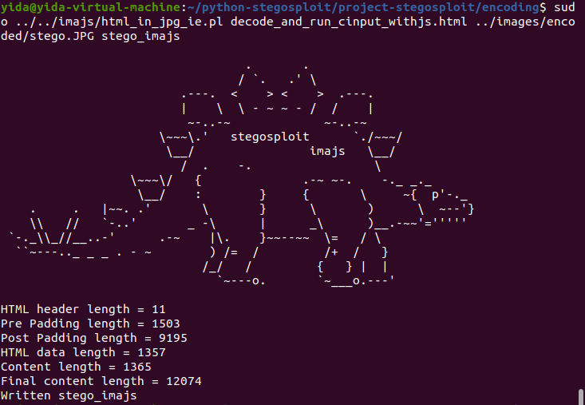
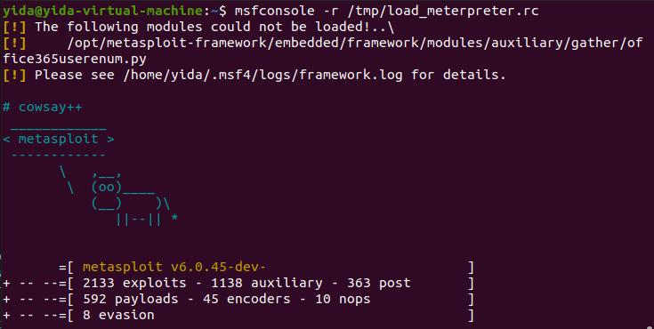

# PyStegosploit - Exploit Delivery via Steganography and Polyglots
by Charmve - yidazhang1 [at] gmail[dot]com, [@Charmve](https://github.com/Charmve)  [@therealsaumil](https://twitter.com/therealsaumil)  [@amichael](https://github.com/amichael7)

May 2021

Stegosploit creates a new way to encode "drive-by" browser exploits and deliver them through image files. These payloads are undetectable using current means. This paper discusses two broad underlying techniques used for image based exploit delivery - Steganography and Polyglots. Drive-by browser exploits are steganographically encoded into JPG and PNG images. The resultant image file is fused with HTML and Javascript decoder code, turning it into an HTML+Image polyglot. The polyglot looks and feels like an image, but is decoded and triggered in a victim's browser when loaded.

## A Tour of the Stegosploit Toolkit [1]

Stegosploit comprises of tools that let a user analyse images, steganographically encode exploit data onto JPG and PNG files, and turn the encoded images into polyglot files that can be rendered as HTML or executed as Javascript.

The current version of Stegosploit is 0.2 and can be found in <a href="https://www.alchemistowl.org/pocorgtfo/pocorgtfo08.pdf">Issue 0x08 of the International Journal of Proof-of-Concept or Get The Fuck Out (Poc||GTFO)</a>. Note that you will have to read through the end of the article in PoC||GTFO to find the hint on how to extract the toolkit.

### 🔍 Browse Folders
- 📄 <code>README.md</code>
- 📄 <code>copying.txt</code> - WTFPL
- 📁 <code>stego/</code>
  - 📄 <code>image_layer_analysis.html</code> - Analyse an image's bit layers
  - 📄 <code>iterative_encoding.html</code> - Encode an exploit onto a JPG or PNG image
  - 📄 <code>imagedecoder.html</code> - Decode a steganographically encoded image
  - 📄 <code>imagedecode.js</code>
  - 📄 <code>histogram.js</code>
  - 📄 <code>md5.js</code>
  - 📄 <code>base64.js</code>
- 📁 <code>exploits/</code>
  - 📄 <code>exploits.js</code> - Canned exploit code
  - 📄 <code>decoder_cve_2014_0282.html</code> - Decoder code + CVE-2014-0282 HTML elements
- 📁 <code>imajs/</code>
  - 📄 <code>html_in_jpg_ie.pl</code> - Generate JPG+HTML polyglot for IE
  - 📄 <code>html_in_jpg_ff.pl</code> - Generate JPG+HTML polyglot for Firefox
  - 📄 <code>html_in_png.pl</code> - Generate a PNG+HTML polyglot (for any browser)
  - 📄 <code>pngenum.pl</code> - Enumerate a PNG file's FourCC chunks
  - 📄 <code>jpegdump.c</code> - Enumerate a JPG file's segments
  - 📄 <code>CRC32.pm</code>
  - 📄 <code>PNGDATA.pm</code>
- ★ 📁 <code>project-stegosploit/</code> - Core Part [<i><u>video show 1</u></i>](https://www.youtube.com/watch?v=O9vSSQIZPlI) | [<i><u>text show 1</u></i>](https://stegosploit.info/#22-steganographically-encoding-the-exploit-code)
  - 📁 <code>encoding/</code> - core 
    - 📄 <code>iterative_encoding.html</code> - Steganographically Encoding the Exploit Code
    - 📄 <code>image_layer_analysis.html</code>
    - 📄 <code>imagedevoder.html</code>
    - 📄 <code>decode_and_run_cinput_withjs.html</code>
  - 📁 <code>exploits/</code> - decoder.html
  - 📁 <code>images/</code> - encoded and original images
  - 📁 <code>polyglots/</code> - lena_poly_demo.html
  - 📁 <code>scripts/</code> - Creates an HTML+PNG polyglot ``polyglot_with_jpg.py`` 
  - 📁 <code>tmp/</code> run ``--/tools/msf4$ ./msfconsole -r ./tmp/load_meterpreter.rc`` [<i><u>video show 2</u></i>](https://www.youtube.com/watch?v=fAyuOhB4uvo)
  - 📄 <code>README.md</code> - Show how to use this project-stegosploit

<code>jpegdump.c</code> is written by Ralph Giles and can be downloaded from <a href="https://svn.xiph.org/experimental/giles/jpegdump.c">https://svn.xiph.org/experimental/giles/jpegdump.c</a>

In this repo, importantly, ``project-stegosploit`` is key part, which show how to hidden <i>Exploit Code</i> into image, to encode/decode, and to execute the <i>meterpreter framework</i>. 

## 🔧 How Stegosploit Works

The exploit code is inserted within the pixels of the image so that the image contains the exploit code.  IMAJS then creates a polyglot image that will be read as an image and contains a decoder that will extract and run the javascript exploit.

The exploit that we will use is an Internet Explorer Use-after-free exploit ([CVE-2014-0282](https://nvd.nist.gov/vuln/detail/CVE-2014-0282)).

## 🔨 Requirements

- Ubuntu 18.04 / Kali / Debian 9
- web service  - ``python -m http.server 8000``
- Metasploit Framework  - [How to Install](https://computingforgeeks.com/how-to-install-metasploit-framework-on-ubuntu-18-04-debian-9/)

## 📆 What we have done so far

__Highlights:__

* The server can serve images to the VM over `10.0.2.2:5000`
* The jpg.py program can build a polyglot file (valid `.html` and `.jpg`)

## 📝 Checklist

- [X] Refactor `CRC32.pm`
- [X] Refactor `PNGDATA.pm`
- [ ] Refactor `html_in_jpg_ie.pl`
- [X] Refactor `pngenum.pl`

- [ ] Demo Server
	- [X] Move all static exploit files in demo pages to `/static`
	- [ ] Make sure all static files are passed parsed using `template_render`
	- [ ] Add an image picker for the image_layer_analysis.html \(Optional\)

## ✨ Related Works *Stegosploit*

My repo 

- [steganography.js](https://github.com/Charmve/xss-test) - Hide secret messages with JavaScript with steganography.js https://charmve.github.io/xss-test/examples/showcase/
- [StegaStamp-plus](https://github.com/Charmve/StegaStamp-plus) - Improved the original repo, 'Invisible Hyperlinks in Physical Photographs', without datasets and training parameters

## ❕ Disclaimer
- This repo follows the GPL open source agreement, please be sure to understand.

- We strictly prohibit all acts that violate any national laws through this program, please use this program within the legal scope.

- By default, using this item will be deemed as your agreement to our rules. Please be sure to abide by the moral and legal standards.

- If you do not comply, you will be responsible for the consequences, and the author will not bear any responsibility!

## 📎 References

[1] https://stegosploit.info/ 

[2] https://conference.hitb.org/hitbsecconf2015ams/sessions/stegosploit-hacking-with-pictures/

[3] https://www.vulnerability-db.com/?q=articles/2015/06/17/exploit-delivery-steganography-using-stegosploit-tool-v02

[4] https://www.blackhat.com/docs/eu-15/materials/eu-15-Shah-Stegosploit-Exploit-Delivery-With-Steganography-And-Polyglots.pdf

[5] https://stackoverflow.com/questions/4110964/how-does-heap-spray-attack-work

[6] https://www.youtube.com/watch?time_continue=1&v=6lYUtIZHlJA

[7] https://www.owasp.org/images/0/01/OWASL_IL_2010_Jan_-_Moshe_Ben_Abu_-_Advanced_Heapspray.pdf

[8] https://en.wikipedia.org/wiki/Heap_spraying

[9] https://developer.microsoft.com/en-us/microsoft-edge/tools/vms/

## ✉️ Contact

yidazhang1[#]gmail[dot]com

 

  <a href="https://github.com/Charmve" target="_blank">Zhang Wei (Charmve)</a>

